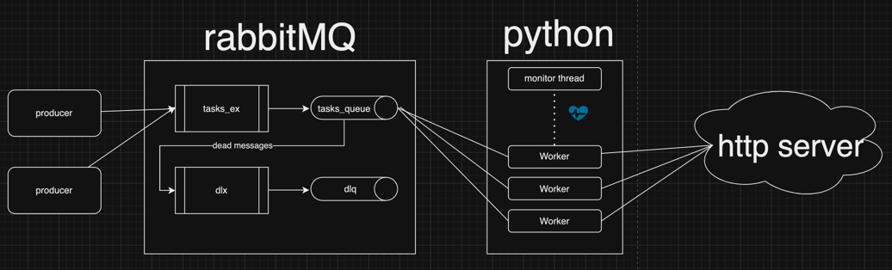

# RabbitMQ demo
this project encapsulates the basics of RabbitMQ. basic understanding of rabbitMQ inner workings is assumed.
it includes instructions from start to finish on how to set up, run, and see a small demo of rabbitMQ.

## Description
our setup consists of the following modules:
1. rabbitMQ 
   1. tasks_ex - the exchange to which the producer(s) produce their message
   2. tasks_queue - the queue from which the consumer(s) consume the message
   3. dlx (dead letter exchange) - the exchange to which the the dead letters arrive
   4. dlq (dead letter queue) - the queue to which the dead letters arrive
2. Python
   1. producer.py - this script publishes a message into the tasks_ex. its message contains a body and an url to which an http request ought to be sent.
   2. main.py - creates and monitors a cluster of Worker threads. if any thread fails, a new one would be created. 
   3. Worker.py - each thread listens to the tasks_queue and when consumes, sends an appropriate http req. if it succeeds it Acks, otherwise Nacks.
   4. setup.py - a script to setup the rabbitMQ. creates the exchanges, queues, and policies required. if a message has failed 3 times it would be considered dead.
   


## Getting Started
1. run:
    ```
    docker run -d --name rabbitmq -p 5672:5672 -p 15672:15672 -e RABBITMQ_DEFAULT_USER=username -e RABBITMQ_DEFAULT_PASS=password rabbitmq:management
    ```
2. change the .env file according to your needs
3. install all the python requirements:
   ```
    pip install -r requirements.txt
    ```
4. setup the rabbit queues and exchanges: 
    ```
    python setup.py
    ```
5. open the web management interface (usually http://locahost:15672) and verify everything you need (exchanges, queues etc)
6. open https://webhook.site for your own http server (basic server to print incoming requests) 

### Executing program - success flow

1. run the all the worker threads:
    ```
     python main.py
    ```
2. now your worker thread are listening for a incoming queue messages
3. in another terminal, produce a message to the exchange: 
    ```
    python produce.py
    ```
4. now you have produced a message into the queue and you should see on your webhook site the request arriving

### Executing program - Dead letter flow
1. tweak your .env to make sure your webhook is unavailable (fk up the url)
2. run the all the worker threads:
    ```
     python main.py
    ```
3. now your worker thread are listening for a incoming queue messages
4. ֿin another terminal, produce a message to the exchange: 
    ```
    python produce.py
    ```
5. now you have produced a message. since the workers' request fails, they will nack. you should see 4 error logs, and then a new message appearing in the dlq queue.